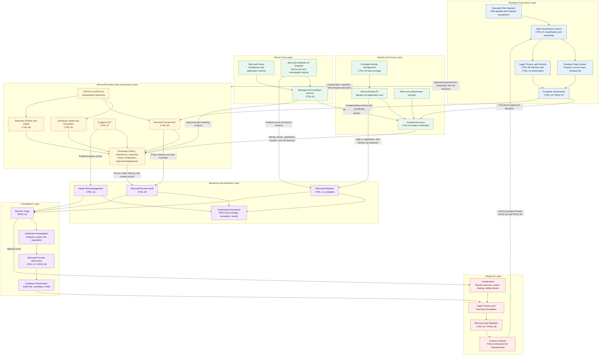

# Enterprise Data Governance and Zero Trust Reference Architecture

```mermaid
flowchart TB
    subgraph BG["Business Governance Layer"]
        direction LR
        ERS["Executive Risk Sponsor<br/>Risk appetite and material acceptance"]
        DGC["Data Governance Council<br/>CTRL-01 classification and ownership"]
        BDO["Business Data Owners<br/>Purpose, access need, residual risk"]
        LRM["Legal, Privacy, and Records<br/>CTRL-08 retention and CTRL-12 preservation"]
        EXC["Exception Governance<br/>CTRL-13 / PROC-07"]
        ERS --> DGC
        DGC --> BDO
        DGC --> LRM
        BDO --> EXC
        LRM --> EXC
    end

    subgraph IA["Identity and Access Layer"]
        direction LR
        ENTRA["Microsoft Entra ID<br/>Identity and application trust"]
        CA["Conditional Access<br/>CTRL-03 explicit verification"]
        MFA["MFA and authentication strength"]
        PIM["Privileged Identity Management<br/>CTRL-04 least privilege"]
        ENTRA --> CA
        MFA --> CA
        PIM --> ENTRA
    end

    subgraph DT["Device Trust Layer"]
        direction LR
        INTUNE["Microsoft Intune<br/>Compliance and application controls"]
        DEFEP["Microsoft Defender for Endpoint<br/>Device risk and investigation signals"]
        DEV["Managed and compliant devices<br/>CTRL-05"]
        INTUNE --> DEV
        DEFEP --> DEV
    end

    subgraph DG["Microsoft Purview Data Governance Layer"]
        direction LR
        DATA["DATA-01 to DATA-04<br/>Classification taxonomy"]
        LABELS["Sensitivity Labels and Encryption<br/>CTRL-02"]
        DLP["Microsoft Purview DLP<br/>CTRL-06"]
        EDLP["Endpoint DLP<br/>CTRL-07"]
        RET["Retention Policies and Labels<br/>CTRL-08"]
        STORES["Exchange Online | SharePoint | OneDrive<br/>Teams | Endpoints | Approved Applications"]
        DATA --> LABELS
        DATA --> DLP
        DATA --> RET
        LABELS --> STORES
        DLP --> STORES
        RET --> STORES
        EDLP --> STORES
    end

    subgraph MD["Monitoring and Detection Layer"]
        direction LR
        AUDIT["Microsoft Purview Audit<br/>CTRL-09"]
        IRM["Insider Risk Management<br/>CTRL-10"]
        MDETECT["Microsoft Defender<br/>CTRL-11 correlation"]
        REPORT["Governance Assurance<br/>PROC-09 coverage, exceptions, trends"]
        AUDIT --> REPORT
        IRM --> REPORT
        MDETECT --> REPORT
    end

    subgraph INV["Investigation Layer"]
        direction LR
        TRIAGE["Security Triage<br/>PROC-04"]
        CASE["Authorized Investigation<br/>Purpose, scope, role separation"]
        EDISC["Microsoft Purview eDiscovery<br/>CTRL-12 / PROC-05"]
        EVID["Evidence Preservation<br/>Audit trail, custodians, holds"]
        TRIAGE --> CASE
        CASE --> EDISC
        EDISC --> EVID
    end

    subgraph RESP["Response Layer"]
        direction LR
        CONTAIN["Containment<br/>Revoke sessions, restrict sharing, isolate device"]
        LEGAL["Legal, Privacy, and Executive Escalation"]
        RECOVER["Recovery and Validation<br/>CTRL-15 / PROC-08"]
        TUNE["Lessons Learned<br/>Policy tuning and risk reassessment"]
        CONTAIN --> LEGAL
        LEGAL --> RECOVER
        RECOVER --> TUNE
    end

    BG -->|"Approved requirements, ownership, and risk decisions"| IA
    BG -->|"Classification, retention, and exception decisions"| DG
    CA -->|"Identity, device, application, location, and risk decision"| STORES
    DEV -->|"Device compliance and risk signals"| CA
    DEV -->|"Approved data handling channel"| STORES
    STORES -->|"Access, label, sharing, and content activity"| AUDIT
    DLP -->|"Policy matches and user overrides"| AUDIT
    EDLP -->|"Endpoint egress activity"| IRM
    DEFEP -->|"Endpoint alerts and device timeline"| MDETECT
    ENTRA -->|"Sign-in, application, and identity risk telemetry"| MDETECT
    AUDIT --> TRIAGE
    IRM --> TRIAGE
    MDETECT --> TRIAGE
    TRIAGE -->|"Material event"| CONTAIN
    EVID --> LEGAL
    TUNE -->|"Control changes through PROC-02 and PROC-09"| DGC
    EXC -->|"Time-bound approved deviation"| CA
    EXC -->|"Compensating controls and monitoring"| DLP

    classDef governance fill:#E8F1FB,stroke:#245A8D,color:#102A43,stroke-width:1px;
    classDef trust fill:#EAF7EE,stroke:#2F855A,color:#173B2A,stroke-width:1px;
    classDef data fill:#FFF6DB,stroke:#B7791F,color:#4A3510,stroke-width:1px;
    classDef detect fill:#F3E8FF,stroke:#7B2CBF,color:#32134F,stroke-width:1px;
    classDef response fill:#FDECEC,stroke:#B83232,color:#4A1616,stroke-width:1px;

    class ERS,DGC,BDO,LRM,EXC governance;
    class ENTRA,CA,MFA,PIM,INTUNE,DEFEP,DEV trust;
    class DATA,LABELS,DLP,EDLP,RET,STORES data;
    class AUDIT,IRM,MDETECT,REPORT,TRIAGE,CASE,EDISC,EVID detect;
    class CONTAIN,LEGAL,RECOVER,TUNE response;
```
