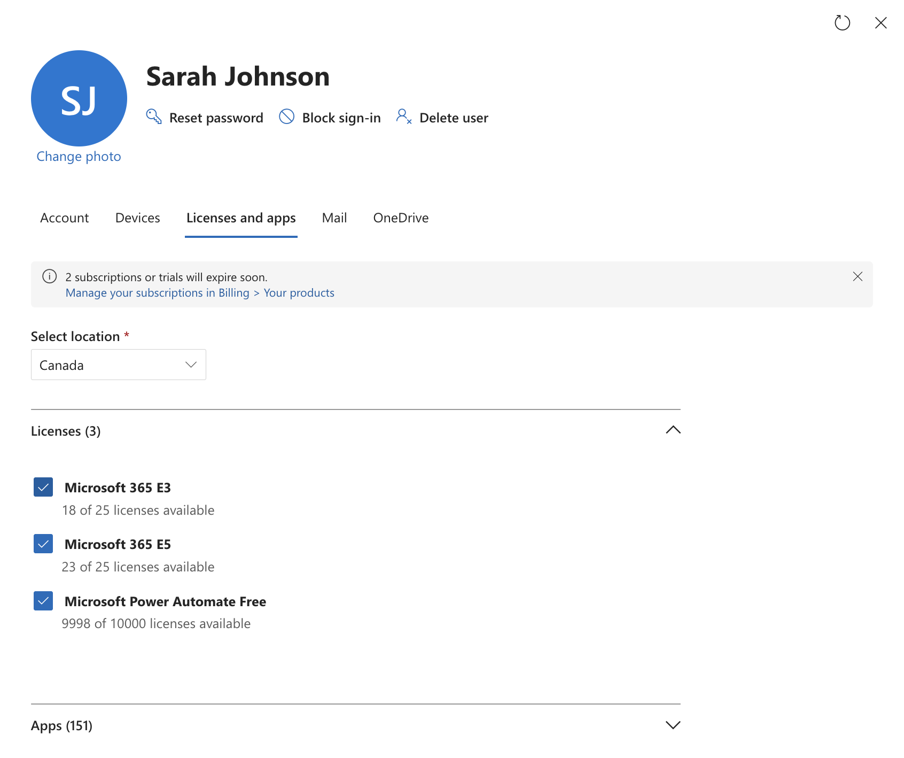
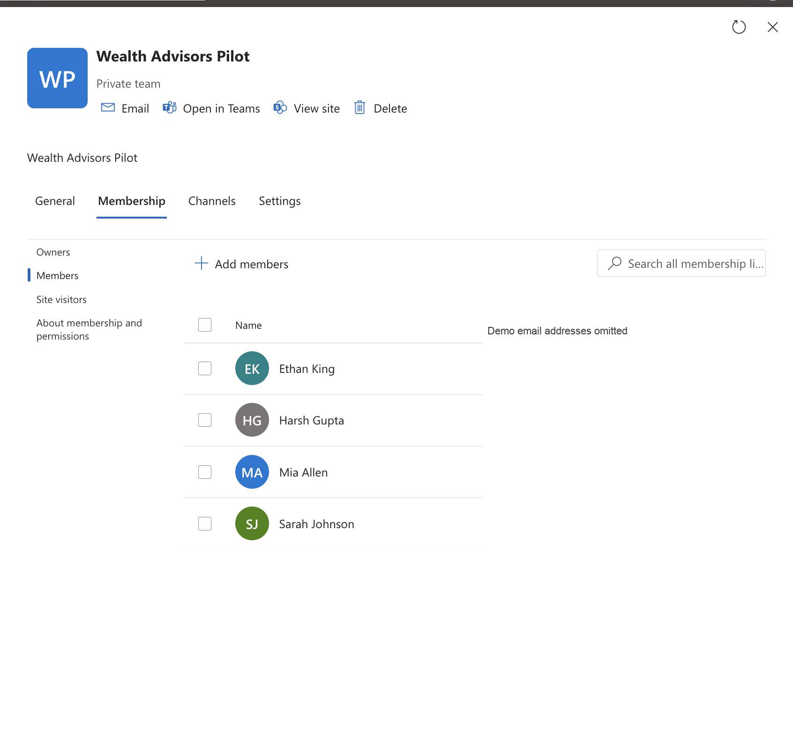
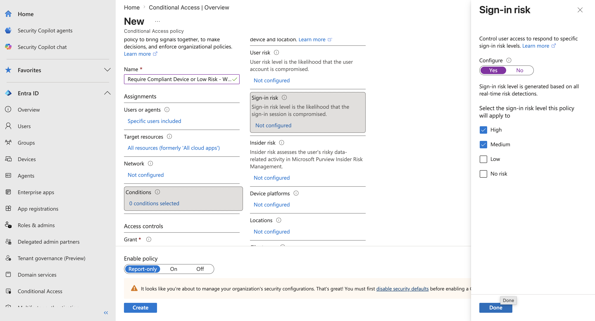
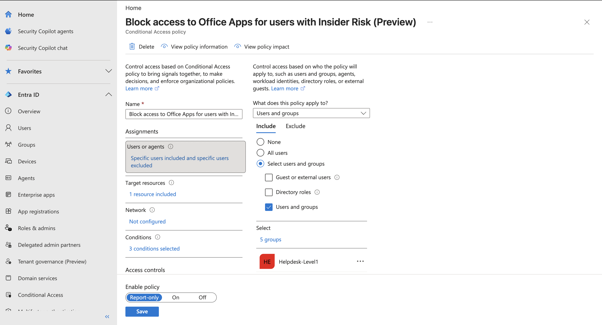
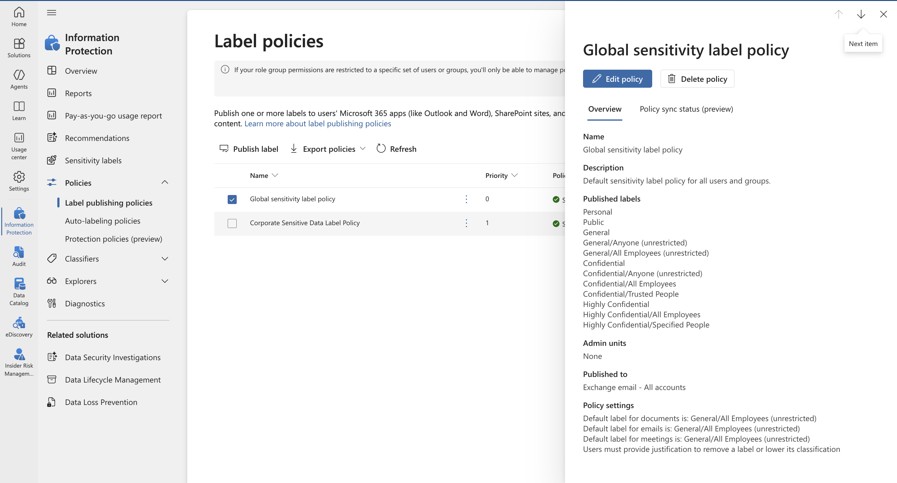
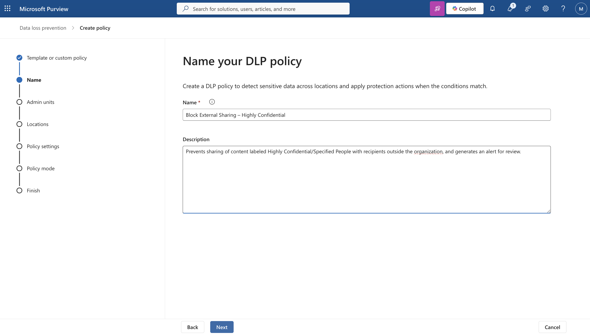
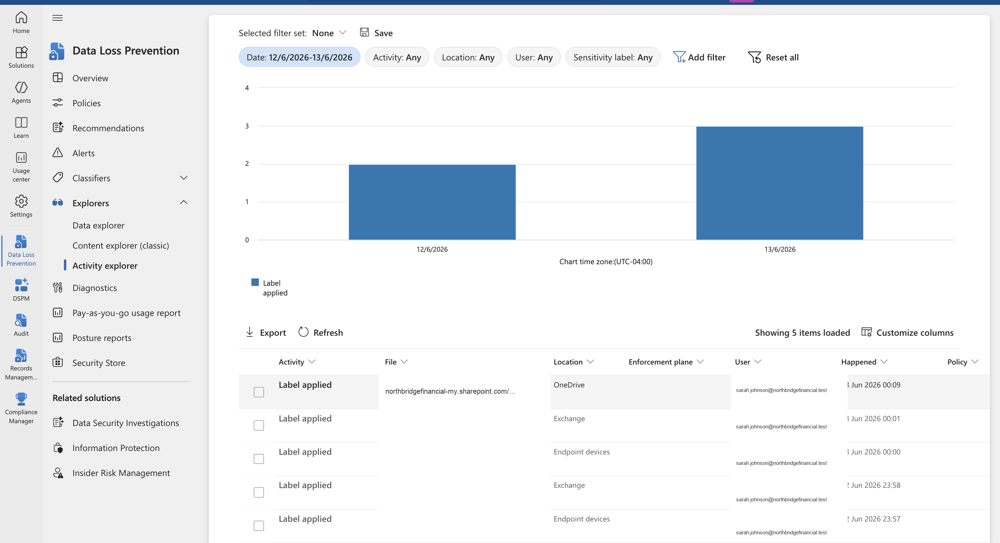
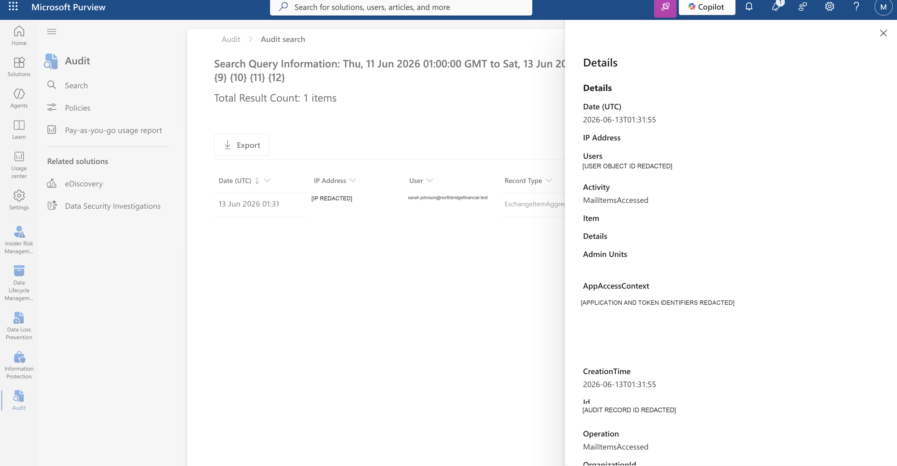

# Phase 2 - Microsoft 365 Evidence Package

## Purpose

This evidence package connects the Phase 1 target-state governance architecture to selected implementation-style artifacts from a Microsoft 365 demonstration environment. It follows a fictional departing-employee scenario involving Sarah Johnson, a Senior Wealth Advisor at NorthBridge Financial.

The package is intentionally selective. Eight screenshots form the primary recruiter-facing gallery, while three supporting screenshots provide additional configuration context without crowding the main story.

> **Important disclaimer:** Phase 2 provides implementation-style evidence from a demo Microsoft 365 environment. The screenshots support a fictional Sarah Johnson data exfiltration investigation scenario and show how selected Microsoft 365, Entra ID, Microsoft Purview, and eDiscovery controls can be configured and reviewed. This evidence does not prove production control effectiveness, regulatory compliance, or a real security incident.

## Scenario Summary

Sarah Johnson is a fictional Senior Wealth Advisor preparing to leave NorthBridge Financial. The scenario examines how identity scope, information classification, policy design, monitoring, audit review, and preservation-location selection could support an authorized investigation into potential customer-financial-data exposure.

The evidence does not show a confirmed exfiltration event, a real DLP alert, an Insider Risk case, or a completed production investigation. It demonstrates representative configuration and review points that would contribute to such a workflow.

## Evidence Index

| # | Domain | Artifact | Demonstrates | Evidence state |
|---|---|---|---|---|
| 1 | Identity & Access | [Sarah Johnson license assignment](screenshots/identity-access/01-sarah-johnson-license-assignment.png) | Fictional user account with Microsoft 365 licensing available for the scenario | Demo configuration |
| 2 | Identity & Access | [Wealth Advisors pilot membership](screenshots/identity-access/02-wealth-advisors-pilot-membership.png) | Sarah included in a scoped business group used for representative policy targeting | Demo configuration |
| 3 | Identity & Access | [Sign-in risk Conditional Access policy](screenshots/identity-access/03-conditional-access-sign-in-risk-report-only.png) | High and medium sign-in risk selected in a report-only policy design | Report-only design |
| 4 | Identity & Access | [Insider Risk Conditional Access preview policy](screenshots/identity-access/04-conditional-access-insider-risk-preview.png) | A preview policy integrating an Insider Risk condition with scoped assignments | Report-only preview configuration |
| 5 | Data Classification | [Sensitivity label publishing policy](screenshots/data-classification/05-sensitivity-label-publishing-policy.png) | Published information-protection taxonomy and default-label settings | Demo configuration |
| 6 | Data Protection | [Highly confidential DLP policy design](screenshots/data-protection/06-dlp-policy-design-highly-confidential.png) | Proposed DLP policy name and purpose for restricting external sharing | Policy design, not deployment proof |
| 7 | Monitoring | [Activity Explorer label events](screenshots/monitoring/07-activity-explorer-label-events.png) | Label-applied events across Microsoft 365 locations for the fictional user | Observed demo portal events |
| 8 | Monitoring | [Audit MailItemsAccessed detail](screenshots/monitoring/08-audit-mail-items-accessed-detail.png) | A Microsoft Purview Audit event reviewed with unique identifiers removed | Observed demo audit event |
| 9 | Evidence Preservation | [Sanitized preservation locations](reports/hold-locations-sanitized.csv) | Mailbox and OneDrive/site locations selected in an eDiscovery preservation export | Sanitized report artifact |

## Core Evidence Gallery

### 1. Identity and License Context

The fictional Sarah Johnson account is shown with Microsoft 365 licensing. This establishes the identity and workload context for the scenario; it does not demonstrate a production onboarding process.

### 2. Business Group Scope

The Wealth Advisors Pilot membership view places Sarah in a representative business group. Tenant-specific email addresses were omitted while fictional display names were retained.

### 3. Sign-In Risk Policy Design

The Conditional Access design selects high and medium sign-in risk and remains in report-only mode. It demonstrates staged policy evaluation rather than enforced access control.

### 4. Insider Risk Conditional Access Integration

This preview configuration shows how an Insider Risk condition could contribute to Conditional Access decisions. It does not show that Sarah received an Insider Risk score or that access was blocked.

### 5. Information Classification

The publishing policy presents a label hierarchy ranging from general handling through highly confidential handling. This supports the Phase 1 classification model without establishing organization-wide adoption or effectiveness.

### 6. DLP Policy Design

The policy-design screen documents the intended purpose of restricting external sharing for highly confidential content. The screenshot does not prove that the policy was completed, enabled, matched an event, or generated an alert.

### 7. Activity Explorer Review

Activity Explorer displays label-applied events across OneDrive, Exchange, and endpoint locations. Tenant-specific URLs and UPNs were replaced with reserved NorthBridge demonstration values.

### 8. Audit Event Review

The audit detail records a `MailItemsAccessed` activity in the demonstration environment. IP, object, application, token, and audit-record identifiers were removed; the event is not presented as proof of malicious activity.

## Supporting Evidence

These artifacts are retained for technical reviewers but are not part of the primary eight-image gallery.

| Artifact | Value | Limitation |
|---|---|---|
| [Corporate Sensitive Data label policy](screenshots/data-classification/09-corporate-sensitive-data-label-policy.png) | Additional label-publication context | Overlaps with the stronger global label-policy screenshot |
| [DLP policy inventory](screenshots/data-protection/10-dlp-policy-inventory.png) | Shows policy modes and synchronization status in the demo tenant | Does not display the scenario-specific DLP policy |
| [Information Protection coverage report](screenshots/data-classification/11-information-protection-coverage-report.png) | Provides a point-in-time portal coverage view | The displayed percentage is not treated as proof of control effectiveness |

## Control Mapping

| Governance area | Phase 2 evidence | Related Phase 1 controls | What remains unverified |
|---|---|---|---|
| Identity & Access | User licensing, group membership, Conditional Access designs | `CTRL-02`, `CTRL-03`, `CTRL-05` | Enforcement results, MFA outcome, device state, and access decision telemetry |
| Data Classification | Label publishing and coverage views | `CTRL-01`, `CTRL-05` | End-user adoption, content accuracy, exception rates, and complete workload coverage |
| Data Protection | DLP design and policy inventory | `CTRL-06`, `CTRL-07` | Scenario-policy deployment, match behavior, user override, alert generation, and blocking outcome |
| Monitoring | Activity Explorer and Purview Audit event | `CTRL-09`, `CTRL-11` | Complete event correlation, incident severity, intent, and data-exposure outcome |
| Investigation | Sanitized preservation-location export | `CTRL-12`, `PROC-04`, `PROC-05` | Case screenshots, hold-policy details, review-set activity, exports, and legal authorization |

## Investigation Timeline

| Sequence | Review point | Evidence-supported statement |
|---|---|---|
| 1 | Identity context | A fictional Sarah Johnson account and Wealth Advisors group scope are visible. |
| 2 | Preventive design | Sensitivity-label and DLP configuration screens document representative policy design. |
| 3 | Access-risk design | Sign-in-risk and Insider Risk Conditional Access configurations are shown in report-only or preview form. |
| 4 | Monitoring | Activity Explorer records label-applied activity across selected workloads. |
| 5 | Audit review | Purview Audit records a `MailItemsAccessed` event for review. |
| 6 | Preservation planning | The sanitized eDiscovery export identifies Sarah's mailbox and OneDrive/site as preservation locations. |

This sequence is an evidence narrative, not a claim that Microsoft 365 automatically correlated the artifacts into one incident.

## Privacy Treatment

Selected screenshots were sanitized using targeted crops and masks. Removed or replaced data includes tenant names, tenant domains, administrator UPNs, SharePoint/OneDrive tenant URLs, IP addresses, object IDs, application IDs, token IDs, and audit-record IDs. Microsoft portal names, policy names, modes, settings, event types, and fictional Sarah Johnson scenario details were retained.

## Limitations

- No screenshots were available for eDiscovery case creation, hold-policy configuration, source selection, or hold completion status.
- The preservation-location CSV lists the fictional mailbox and site locations but does not independently prove legal authorization or production hold effectiveness.
- The available DLP screenshot documents policy design, not final policy deployment or a scenario-specific alert.
- No Insider Risk alert, case, risk score, or investigation-priority change is claimed.
- Activity Explorer shows label-applied events, not a confirmed external-sharing attempt.
- The supplied Purview search export contained headers but no data rows and was excluded.
- All people and organizations in the scenario are fictional.

## Phase 1 Design References

- [Data Classification and Governance Taxonomy](../governance/data-classification-governance-taxonomy.md)
- [Risk Control Matrix](../governance/risk-control-matrix.md)
- [Reference Architecture](../architecture/reference-architecture.md)
- [Data Exfiltration Investigation Scenario](../operations/data-exfiltration-investigation-scenario.md)

[Back to the repository overview](../README.md)
